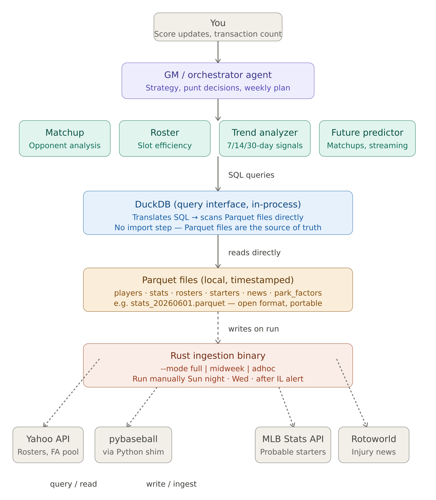

# Fantasy Baseball GM

An AI-powered fantasy baseball assistant built on a multi-agent architecture.
The system analyzes player trends, opponent tendencies, and matchup state to
produce weekly roster and category strategy recommendations.

## Architecture

data/ # Parquet files (generated by bootstrap.py or Rust binary) and CSV files generated by sub-agents
skills/ # Agent Skill.md files (Cowork agent instructions)
evals/ # Eval CSVs and JSON for measuring agent accuracy
data_client.py # DuckDB query layer — all agents read data through this
eval_runner.py # python orchestration script for running evals that outputs a JSON with results
SKILL.md # Project-wide architecture reference

### Agents
| Agent | Purpose |
|-------|---------|
| Trend Analyzer | Player hot/cold/regression signals |
| Matchup | Opponent tendency and category gap analysis |
| GM | Synthesizes agent outputs into weekly strategy |
| Future Predictor | Upcoming schedule, two-start pitchers, and park factor analysis |
| Roster Management | Identifies inefficient players and scores free agent pool |

## Scoring System
5x5 head-to-head categories:
- **Batting**: R, HR, RBI, SB, OBP
- **Pitching**: W, SV, K, ERA, WHIP

## Setup
1. Copy `config.toml.example` to `config.toml` and fill in your Yahoo OAuth credentials
2. If midweek run, prefill `midweek_matchup_state.csv`
3. Run the Rust binary with `--mode full | midweek | adhoc` to pull data, then run each agent skill via Claude Code

## Data Sources (all Phase 2)
- Yahoo Fantasy Sports API (OAuth2) — roster and matchup data
- Baseball Savant — advanced Statcast metrics
- FanGraphs — pitching velocity and park factors
- pybaseball — Python shim for programmatic access

## Configuration
`config.toml` contains Yahoo OAuth credentials and is **gitignored**.
Do not commit this file. See `config.toml.example` for the required format.

## Eval Framework
Agent outputs are evaluated weekly against real outcomes.
See `evals/` for methodology and results by agent.

## League Rules
- 12 batters / 8 pitchers active roster / 3 bench slots / max 3 IL slots
- 20 IP weekly minimum (forfeit all pitching categories if not met)
- 7 transactions per week